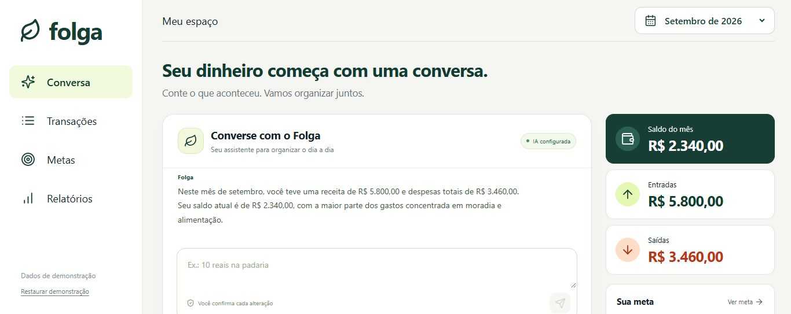
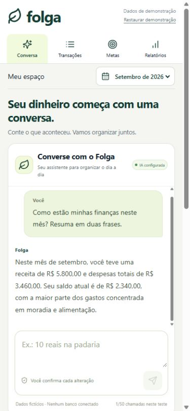
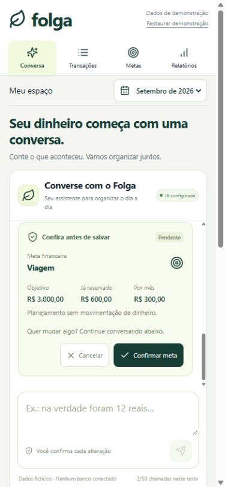
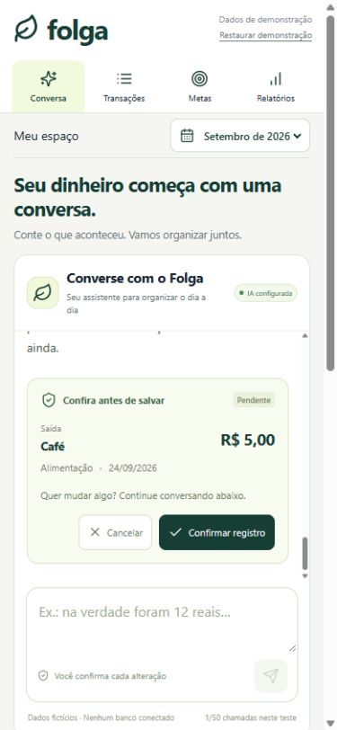
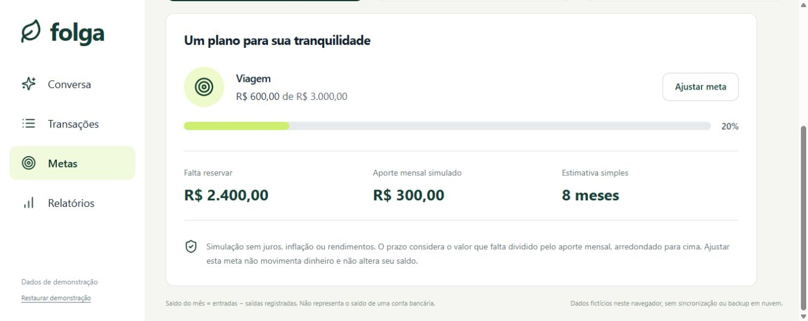
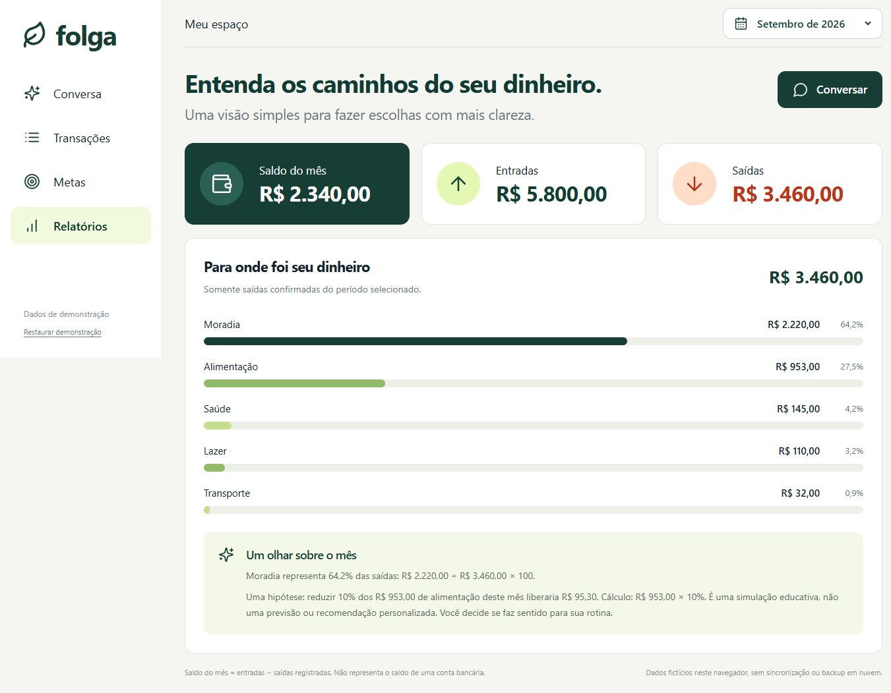

# Folga — seu dinheiro, com mais respiro

**Organize suas finanças por meio de uma conversa.**

Projeto conceitual do desafio [App de Organização de Finanças Pessoais com Vibe Coding — DIO](https://github.com/digitalinnovationone/dio-lab-vibe-coding-app-financas). Esta entrega reúne o PRD, os prompts, as capturas do aplicativo e uma reflexão sobre o processo.

## O conceito

O Folga ajuda quem está começando a organizar o dinheiro e considera formulários e planilhas trabalhosos. A pessoa conta o que aconteceu, conversa com o assistente e confere uma prévia antes de salvar. Pode corrigir o valor ou a categoria pela própria conversa, entender o mês e planejar uma meta.

O chat é a entrada principal do aplicativo. Transações, metas e relatórios complementam a conversa, dando contexto e permitindo conferir os resultados.

| Funcionalidade | Experiência proposta |
| --- | --- |
| Registrar gastos e receitas | Descrever em linguagem natural e conferir a prévia |
| Classificar e corrigir | Revisar a categoria sugerida e pedir ajustes pela conversa |
| Entender o mês | Consultar entradas, saídas e saldo dos registros confirmados |
| Planejar metas | Informar objetivo, valor guardado e prazo ou aporte mensal |
| Acompanhar o progresso | Ver uma projeção simples e a distribuição das despesas |

**A versão demonstrada usa IA real, com Gemini 3.1 Flash Lite em um teste local.** Todos os números das capturas são fictícios. A IA interpreta as mensagens; o aplicativo valida as prévias e calcula os resumos. Somente o botão de confirmação salva uma alteração.

O saldo é a diferença entre entradas e saídas registradas. Metas são simulações sem juros e não movimentam dinheiro. O protótipo guarda dados no navegador, sem bancos conectados nem sincronização em nuvem. Este repositório apresenta a documentação e as evidências; não disponibiliza um aplicativo hospedado.

## Materiais da entrega

| Material | O que contém |
| --- | --- |
| [PRD / prompt final](docs/PRD.md) | Problema, público, telas, comportamento do agente e critérios de aceitação |
| [Prompts e evolução](docs/PROMPTS.md) | Pedidos, refinamentos e exemplos de interação |
| [Processo e reflexão](docs/PROCESSO-E-REFLEXAO.md) | Decisões, dificuldades, validações e aprendizados |
| [Capturas do aplicativo](docs/evidencias) | Evidências reais da experiência no desktop e no celular |

## Prompt final — PRD

Briefing consolidado da versão aprovada, organizado para reproduzir os requisitos após os refinamentos. A evolução dos pedidos está registrada em [Prompts e evolução](docs/PROMPTS.md).

<strong>Ler o PRD completo</strong>

## PRD / prompt final — Folga

> Briefing final consolidado para reproduzir a proposta após as revisões. Não é uma transcrição de uma única mensagem histórica. Os requisitos abaixo orientam o produto; as verificações realizadas estão resumidas em [Processo e reflexão](docs/PROCESSO-E-REFLEXAO.md).

### Contexto e objetivo

Crie o **Folga**, um aplicativo educativo de organização de finanças pessoais por conversa. A proposta é: **“Converse sobre o seu dinheiro. Entenda o seu mês.”**

A conversa deve ser a tela principal. A pessoa precisa conseguir registrar uma despesa, entender os gastos do mês e planejar uma meta com linguagem natural, sem começar por um formulário ou uma planilha.

Use português do Brasil, linguagem acessível e uma interface responsiva. Entregue um MVP demonstrável com dados fictícios, acompanhado do conceito, das telas, dos prompts e de uma reflexão sobre o processo. A entrega pública do desafio deve conter documentação e capturas, sem código-fonte ou HTML.

### Problema, público e hipótese

Muitas pessoas abandonam o controle financeiro por causa do esforço de preencher campos e da dificuldade de transformar números em decisões compreensíveis.

O público inicial são pessoas adultas que estão começando a organizar o dinheiro, principalmente pelo celular. A hipótese é que uma conversa com prévias simples e confirmação explícita torne o registro menos trabalhoso. Essa hipótese ainda precisa de validação com participantes.

### Cinco capacidades do MVP

| Capacidade | Experiência esperada |
| --- | --- |
| Registrar por conversa | “10 reais na padaria” gera uma prévia de despesa, sem salvar automaticamente |
| Classificar e corrigir | A IA sugere Alimentação; “na verdade foram 12 reais” corrige a prévia atual |
| Entender o mês | Perguntas sobre receitas, despesas e categorias usam o contexto dos registros confirmados |
| Planejar uma meta | O assistente esclarece objetivo, valor já reservado e aporte; apresenta uma proposta confirmável |
| Consultar detalhes | Transações, metas e relatórios complementam a conversa com números verificáveis |

### Comportamento do assistente

O assistente deve conversar de forma breve, acolhedora e sem julgamento. Faça uma pergunta por vez quando faltar informação. Evite culpa, promessas de economia garantida e recomendações de investimentos específicos.

- Diferencie uma sugestão de uma alteração efetivamente salva.
- Não invente transações, valores, datas, rendimentos ou informações ausentes.
- Use o resumo calculado pelo aplicativo ao falar de saldos e categorias.
- Quando receber uma correção, preserve os campos da prévia que não foram alterados.
- Mostre apenas uma prévia de alteração por vez: transação ou meta.
- Consultar o mês não deve criar um lançamento ou substituir uma meta.
- Uma mensagem como “confirmo” não substitui o botão de confirmação da interface.
- Não apresente uma resposta em linguagem natural como prova de que algo foi salvo.
- Em falhas de conexão, limite de uso ou resposta inválida, explique o ocorrido e ofereça nova tentativa sem modificar os registros.

### Jornada principal

1. Abrir a tela **Conversa**, com o cenário fictício de setembro de 2026 identificado.
2. Escrever “10 reais na padaria”.
3. Conferir a prévia com descrição, categoria, data e valor.
4. Escrever “na verdade foram 12 reais” para corrigir o valor.
5. Usar **Confirmar registro** ou **Cancelar**.
6. Após confirmar, consultar o resumo atualizado e perguntar sobre os gastos do mês.
7. Pedir ajuda para uma meta, completar as informações necessárias e revisar a proposta antes de confirmá-la.

### Telas e hierarquia visual

#### Conversa — tela principal

O chat ocupa a maior área da tela, com histórico legível, sugestões de início e campo de mensagem evidente. As sugestões iniciais são **Registrar gasto**, **Entender meu mês** e **Criar uma meta**.

No desktop, receitas, despesas, saldo, meta e últimos registros aparecem em uma coluna complementar. No celular, a conversa continua sendo o primeiro conteúdo e os resumos ficam em segundo plano. Use verde escuro, superfícies claras e espaçamento suficiente para a leitura.

A prévia deve aparecer junto da conversa e oferecer confirmação e cancelamento claros. A confirmação cria uma única alteração; cliques repetidos não podem duplicá-la. Mantenha a conversa ao navegar entre telas e preserve o conteúdo local válido ao recarregar.

#### Transações

Liste os lançamentos confirmados com descrição, data, categoria, tipo e valor. Ofereça busca, filtros, exclusão e possibilidade de desfazer a última exclusão. Resumos e relatórios devem acompanhar as mudanças.

#### Metas

Mostre objetivo, valor-alvo, valor já reservado, aporte mensal e progresso. Permita planejar e revisar a meta sem movimentar dinheiro. Identifique a projeção como uma conta simples, sem juros ou rendimentos.

#### Relatórios

Apresente as despesas por categoria com valores e percentuais. As observações educativas devem apontar os números que as sustentam. Sem despesas no período, mostre um estado vazio, sem percentuais inválidos.

### Regras financeiras e confirmação

- Trate valores monetários em centavos e apresente-os em reais no padrão brasileiro.
- **Receitas:** soma das entradas confirmadas do período.
- **Despesas:** soma das saídas confirmadas do período.
- **Saldo do período:** receitas menos despesas; não é um saldo bancário conectado.
- **Valor restante de uma meta:** máximo entre zero e alvo menos valor reservado.
- **Prazo estimado:** valor restante dividido pelo aporte mensal positivo, arredondado para cima em meses.
- Se o aporte for zero, informe que não há prazo calculado. Se a meta já estiver coberta, não invente meses restantes.
- Calcule totais e a projeção exibida na prévia por regras do aplicativo, independentemente do texto gerado pela IA.
- Alterar uma meta ou simular um aporte não cria uma despesa, transfere dinheiro ou aumenta automaticamente a reserva.

Exemplo: alvo de R$ 3.000, R$ 600 já reservados e aporte de R$ 300 por mês resultam em uma projeção de oito meses, sem rendimentos.

### IA, dados e limites do teste

A versão local de teste utiliza **Gemini 3.1 Flash Lite** para interpretar mensagens e conversar com contexto. Não apresente a experiência final como um interpretador exclusivamente por regras.

As chamadas passam por um servidor local. A credencial permanece em arquivo local ignorado pelo Git, fora do navegador, das capturas e da documentação pública. O aplicativo valida os dados propostos antes de criar uma prévia e controla a confirmação separadamente da resposta da IA.

Use apenas dados fictícios de setembro de 2026. Registros, meta e histórico da conversa ficam no `localStorage` do navegador. Isso não significa que a IA funciona offline: mensagens e contexto necessário são enviados ao provedor durante a conversa. Não há sincronização nem backup em nuvem dos registros do aplicativo.

Adote limites de chamadas para o teste, respostas curtas e tratamento explícito de indisponibilidade. Cotas do provedor podem variar; não prometa gratuidade ilimitada.

#### Fora do escopo

Integração bancária, Open Finance, pagamentos, movimentação de dinheiro, autenticação, contas compartilhadas, sincronização entre dispositivos, importação de extratos, recomendações de investimentos e operação pública em produção.

O teste é local. A publicação do material no GitHub não equivale a hospedar o aplicativo.

### Critérios de aceitação

| Situação | Resultado esperado |
| --- | --- |
| Abrir o aplicativo | Conversa em destaque, período e dados fictícios identificáveis |
| Enviar um gasto válido | Prévia com dados revisáveis; totais ainda inalterados |
| Corrigir o valor em uma nova mensagem | Atualização da mesma prévia, sem registro duplicado |
| Confirmar ou cancelar | Uma alteração após confirmar; nenhuma alteração ao cancelar |
| Informar dados insuficientes | Pergunta de esclarecimento, sem preenchimento inventado |
| Consultar gastos do mês | Resposta coerente com o resumo calculado dos registros confirmados |
| Planejar uma meta | Prévia com valores, projeção determinística e confirmação explícita |
| O modelo escrever como se tivesse salvado uma prévia | Interface mantém o estado pendente e usa mensagem de prévia, sem anunciar gravação |
| Falhar a chamada à IA | Erro compreensível e nova tentativa, sem perda ou alteração indevida dos registros |
| Recarregar ou trocar de tela | Preservação do estado local válido da conversa e das finanças |
| Usar desktop e celular | Conteúdo legível, ações acessíveis e ausência de rolagem horizontal indevida |

Verifique esses caminhos com dados fictícios. Diferencie testes automatizados, conferência visual e chamadas reais à IA; nenhum deles, isoladamente, representa uma pesquisa de usabilidade ou garantia de ausência de falhas.

### Validação futura proposta

Convide cinco pessoas iniciantes para registrar e corrigir uma despesa, cancelar uma prévia, consultar o mês e interpretar uma meta. Observe se entendem que a prévia ainda não foi salva e que uma simulação não movimenta dinheiro.

Como metas iniciais, busque quatro de cinco participantes concluindo as tarefas sem ajuda e todos distinguindo prévia de confirmação. Essas são metas de um experimento futuro, não resultados já obtidos.

### Entregáveis

1. Resumo do conceito e do problema.
2. Este PRD / prompt final e o registro da evolução dos prompts.
3. Capturas reais do aplicativo e evidências de interação com IA, com legendas claras.
4. Reflexão sobre decisões, ajustes, aprendizados e limitações.
5. README organizado para leitura independente da conversa de criação.

## Telas e interações reais

As capturas abaixo foram feitas no protótipo local. Mostram respostas da IA e cartões de prévia apresentados pelo aplicativo. Não são imagens geradas para simular uma conversa.

### Conversar, revisar e confirmar

| Consulta do mês | Prévia de uma meta | Prévia de um gasto |
| :---: | :---: | :---: |
|  |  |  |

Na consulta, as entradas de R$ 5.800,00 e as saídas de R$ 3.460,00 resultam em R$ 2.340,00 no mês. No plano de viagem, faltam R$ 2.400,00: em oito meses, o aporte é de R$ 300,00 mensais, sem juros. A prévia do café demonstra o passo de confirmação antes de registrar.

### Acompanhar metas e despesas

<strong>Ver a tela de metas</strong>

<strong>Ver o relatório por categoria</strong>

## Reflexão sobre o processo

O primeiro desenho deixava o chat em segundo plano. Ao revisar o problema, ficou claro que a conversa deveria orientar a experiência. Essa mudança aproximou a interface da proposta de reduzir o esforço para organizar as finanças.

O que funcionou melhor foi transformar intenções em exemplos verificáveis: registrar, corrigir, conferir os valores e só então confirmar. O teste com IA real trouxe flexibilidade, mas também mostrou que uma resposta convincente não garante um comportamento correto. Uma resposta chegou a dizer que havia registrado um gasto antes da confirmação; por isso, a comunicação das prévias passou a ser controlada pelo aplicativo.

Também ocorreram falhas pontuais do serviço. Preservar a mensagem e permitir o reenvio ajudou a manter o fluxo sem alterações indevidas. A principal aprendizagem foi que conversar com IA exige contexto, limites claros e revisão do resultado. O prompt inicia o trabalho; a observação e os ajustes tornam a proposta mais consistente.

Foram verificados registros, correções, confirmação, cancelamento, consultas, planejamento de meta e persistência da conversa, além da apresentação no desktop e no celular. A versão local passou por 22 testes automatizados e pela geração de build. Isso valida os cenários exercitados; ainda não houve pesquisa com usuários nem comprovação de economia financeira real.

Leia a análise detalhada em [Processo e reflexão](docs/PROCESSO-E-REFLEXAO.md).
