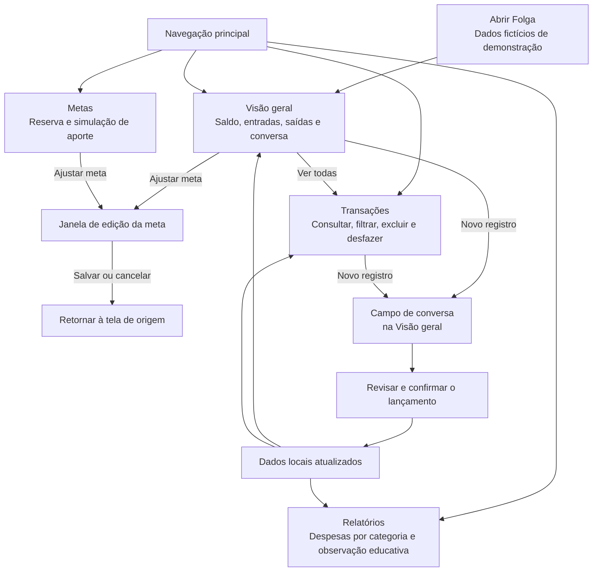
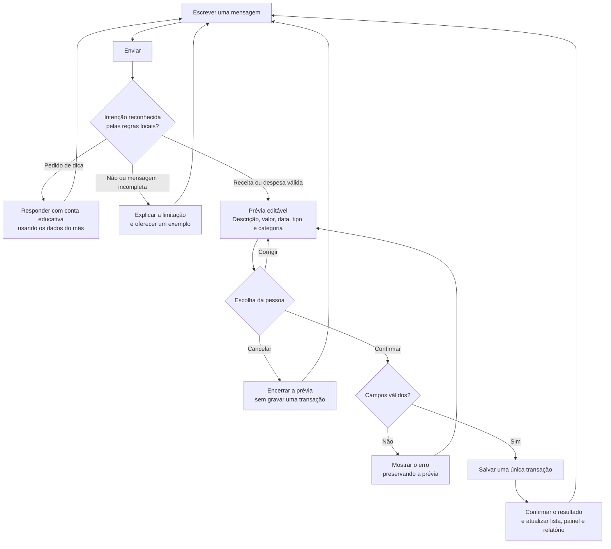

# Fluxo de telas e comportamento do agente — Folga

O Folga demonstra como uma conversa pode reduzir o esforço de registrar receitas e despesas. A navegação tem quatro destinos. A conversa fica dentro da **Visão geral**, próxima aos números que ela ajuda a atualizar.

Este documento descreve o fluxo do protótipo e o comportamento esperado do agente no conceito de produto. **O assistente executado no aplicativo é uma simulação por regras locais, sem modelo generativo conectado.**

## 1. Mapa de navegação

| Destino | Pergunta que ajuda a responder | Ação principal |
| --- | --- | --- |
| Visão geral | Como estão os registros do meu mês? | Registrar uma receita ou despesa por conversa |
| Transações | Quais lançamentos formam esses números? | Consultar, filtrar e corrigir um registro incorreto por exclusão/desfazer |
| Metas | Quanto falta para a reserva e qual seria o prazo com este aporte? | Ajustar a meta e experimentar o aporte mensal |
| Relatórios | Em quais categorias estão as minhas despesas? | Ler valores, proporções e uma hipótese educativa |

O saldo do mês representa **entradas menos saídas registradas no período selecionado**. A reserva é um cenário separado: alterar seu aporte simulado não movimenta dinheiro nem cria uma transação.

## 2. Estados do registro por conversa

A prévia é a etapa central de controle: interpretar a frase não significa registrar a transação. Uma categoria sugerida pode estar errada, e a pessoa tem a oportunidade de corrigi-la antes de confirmar.

Uma confirmação concluída deve encerrar aquela prévia. Clicar novamente no mesmo ponto da interface não deve duplicar o lançamento.

## 3. Tom e limites do agente

| Princípio | Aplicação |
| --- | --- |
| Linguagem simples | Explicar o que foi entendido e o que a pessoa precisa fazer agora |
| Ausência de julgamento | Descrever valores e possibilidades, sem classificar escolhas pessoais como boas ou ruins |
| Controle da pessoa | Pedir revisão; permitir cancelar; não salvar pela simples interpretação da frase |
| Transparência | Identificar a demonstração e mostrar os números usados em uma observação |
| Limites claros | Pedir reformulação quando as regras não reconhecerem a mensagem |
| Educação | Apresentar hipóteses e contas simples, sem garantir economia ou recomendar investimentos |

**Tom adequado:** “Confira o valor e a categoria antes de confirmar.”

**Tom inadequado:** “Você gasta demais e precisa cortar isso imediatamente.”

**Limitação comunicada com utilidade:** “Informe uma entrada ou um gasto por vez. Ex.: ‘Gastei 28 no almoço’.”

Não é necessário encenar uma personalidade humana para tornar a experiência acolhedora. Clareza, revisão e mensagens respeitosas são mais importantes que respostas longas.

## 4. Exemplos demonstrativos de comportamento

Os exemplos abaixo explicam o fluxo e as regras. **Não são transcrições de participantes, capturas de um teste de usabilidade ou comprovação de economia real.**

### Exemplo A — uma despesa simples

**Mensagem de exemplo:** “Gastei R$ 45,90 no almoço”.

**Prévia esperada:** saída de R$ 45,90, descrição “Almoço”, categoria “Alimentação” e data de referência da demonstração visível.

**Escolha:** a pessoa pode ajustar os campos, cancelar ou confirmar. Os totais só mudam após confirmar.

### Exemplo B — uma receita

**Mensagem de exemplo:** “Recebi R$ 800 de freelance”.

**Prévia esperada:** entrada de R$ 800,00, descrição “Freelance” e categoria “Receita”.

**Escolha:** confirmar cria um lançamento de entrada; cancelar não cria registro.

### Exemplo C — mensagem incompleta

**Mensagem de exemplo:** “Gastei no mercado”.

**Comportamento esperado:** solicitar um único valor e oferecer um exemplo válido. O sistema não deve estimar quanto a pessoa gastou.

### Exemplo D — pedido educativo

**Mensagem de exemplo:** “Como posso economizar?”.

**Comportamento implementado pelas regras:** somar as despesas de Alimentação do mês selecionado e mostrar o efeito hipotético de uma redução de 10%, com a fórmula utilizada.

**Exemplo de conta, usando um valor hipotético de R$ 500,00:** R$ 500,00 × 10% = R$ 50,00. Isso significa uma possibilidade matemática para exploração; não indica que R$ 50,00 foram economizados nem que reduzir essa categoria é adequado para qualquer pessoa.

Sem despesas de alimentação naquele mês, o assistente explica que faltam registros para essa simulação específica. Ele não substitui os dados ausentes por valores inventados.

### Exemplo E — planejamento da reserva

**Cenário demonstrativo:** alvo de R$ 3.000,00, valor já reservado de R$ 1.200,00 e aporte mensal de R$ 300,00.

**Conta:** faltam R$ 1.800,00; R$ 1.800,00 ÷ R$ 300,00 = 6 meses.

**Limites:** não há juros, inflação ou rendimento na conta. Alterar o aporte só altera a simulação e não transfere recursos.

## 5. Estados que precisam ser compreensíveis

- **Sem registros no período:** explicar a ausência de dados e facilitar um primeiro lançamento.
- **Filtro sem resultados:** permitir limpar o filtro sem apagar dados.
- **Mensagem não reconhecida:** preservar a possibilidade de tentar novamente, com exemplo do formato aceito.
- **Prévia inválida:** apontar o campo que precisa de correção, sem salvar parcialmente.
- **Registro concluído:** confirmar o sucesso e refletir a alteração nas outras áreas.
- **Exclusão:** oferecer retorno imediato e a ação de desfazer disponível na interface.
- **Aporte inválido:** evitar prazo negativo, infinito ou silenciosamente incorreto.
- **Armazenamento indisponível ou incompatível:** informar a limitação e permitir seguir com a sessão demonstrativa.

## 6. Relação entre conceito e implementação

| Conceito de produto | Demonstração deste projeto | Evolução possível |
| --- | --- | --- |
| Conversa natural com agente financeiro | Interpretador local com frases e palavras-chave reconhecidas | Modelo de linguagem com saída estruturada, validação e consentimento |
| Classificação assistida | Sugestão por categoria, revisável antes de salvar | Classificação contextual com avaliação da precisão |
| Plano personalizado de economia | Hipótese fixa de 10% em alimentação e simulação simples de reserva | Preferências, restrições e metas definidas pela pessoa |
| Histórico financeiro acessível | Registros locais no navegador | Conta com sincronização, backup e controles de acesso |

As evoluções acima não fazem parte da entrega atual. Qualquer futura integração com IA ou armazenamento remoto exigiria decisões adicionais sobre privacidade, custos, segurança e qualidade das respostas.
